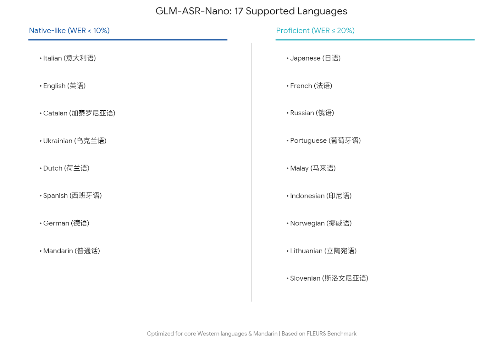

# GLM-ASR

[中文阅读.](./README_zh.md)

<div align="center">

</div>
<p align="center">
    👋 Join our <a href="resources/WECHAT.md" target="_blank">WeChat</a> community
</p>

## Model Introduction

**GLM-ASR-Nano-2512** is a robust, open-source speech recognition model with **1.5B parameters**. Designed for
real-world complexity, it outperforms OpenAI Whisper V3 on multiple benchmarks while maintaining a compact size.

Key capabilities include:

* **Exceptional Dialect Support**
  Beyond standard Mandarin and English, the model is highly optimized for **Cantonese (粤语)** and other dialects,
  effectively bridging the gap in dialectal speech recognition.

* **Low-Volume Speech Robustness**
  Specifically trained for **"Whisper/Quiet Speech"** scenarios. It captures and accurately transcribes extremely
  low-volume audio that traditional models often miss.

* **SOTA Performance**
  Achieves the **lowest average error rate (4.10)** among comparable open-source models, showing significant advantages
  in Chinese benchmarks (Wenet Meeting, Aishell-1, etc..).

## Benchmark

We evaluated GLM-ASR-Nano against leading open-source and closed-source models. The results demonstrate
that **GLM-ASR-Nano (1.5B)** achieves superior performance, particularly in challenging acoustic environments.


Notes:

* Wenet Meeting reflects real-world meeting scenarios with noise and overlapping speech.
* Aishell-1 is a standard Mandarin benchmark.

## Supported Languages

GLM-ASR-Nano supports **17 languages** with high usability (WER ≤ 20%), specifically optimized for the following regions:



## Download

| Model             | Download Links                                                                                                                                             |
|-------------------|------------------------------------------------------------------------------------------------------------------------------------------------------------|
| GLM-ASR-Nano-2512  | [🤗 Hugging Face](https://huggingface.co/zai-org/GLM-ASR-Nano-2512)<br>[🤖 ModelScope](https://modelscope.cn/models/ZhipuAI/GLM-ASR-Nano-2512)               |

* Please note that the model weight format has changed after adapting to `transformers` and `SGLang`. If your model was downloaded before December 27, 2025, please pull the latest version of the model.

## Inference

We provide two test audio clips, in Chinese and English versions respectively.

### Requirements

```bash
pip install -r requirements.txt
sudo apt install ffmpeg
```

### Example Code

* transformers 5.0.0, requires installation from source, refer to requirements.txt

```python
from transformers import AutoModel, AutoProcessor
import torch

device = "cuda" if torch.cuda.is_available() else "cpu"
repo_id = "zai-org/GLM-ASR-Nano-2512"

processor = AutoProcessor.from_pretrained(repo_id)
model = AutoModel.from_pretrained(repo_id, dtype=torch.bfloat16, device_map=device)

messages = [
    {
        "role": "user",
        "content": [
            {
                "type": "audio",
                "url": "example_zh.wav",
            },
            {"type": "text", "text": "Please transcribe this audio into text"},
        ],
    }
]

inputs = processor.apply_chat_template(
    messages, tokenize=True, add_generation_prompt=True, return_dict=True, return_tensors="pt"
)
inputs = inputs.to(device, dtype=torch.bfloat16)
outputs = model.generate(**inputs, max_new_tokens=128, do_sample=False)
print(processor.batch_decode(outputs[:, inputs.input_ids.shape[1]:], skip_special_tokens=True))
```

* SGLang

Currently, no release version is available. Please use the latest development docker image.

```shell
docker pull lmsysorg/sglang:dev
```

Enter the docker container and run

```shell
pip install git+https://github.com/huggingface/transformers
python3 -m sglang.launch_server   --model-path /cloud/oss_checkpoints/zai-org/GLM-ASR-Nano-2512 --mem-fraction-static 0.8   --served-model-name glm-asr   --host 0.0.0.0   --port 8000
```

send requests to the server using the following example code:

```python
from openai import OpenAI

openai_api_key = "EMPTY"
openai_api_base = "http://127.0.0.1:8000/v1"

client = OpenAI(api_key=openai_api_key, base_url=openai_api_base)
response = client.chat.completions.create(
    model="glm-asr",
    messages=[
        {
            "role": "user",
            "content": [
                {
                    "type": "audio_url",
                    "audio_url": {"url": "example_zh.wav"}
                },
                {
                    "type": "text",
                    "text": "Please transcribe this audio into text"
                },
            ]
        }
    ],
    max_tokens=1024,
)
print(response.choices[0].message.content.strip())
```

* transformers 4.51.3 (for models that have not been updated)

```shell
python inference.py --checkpoint_dir zai-org/GLM-ASR-Nano-2512 --audio examples/example_en.wav # English
python inference.py --checkpoint_dir zai-org/GLM-ASR-Nano-2512 --audio examples/example_zh.wav # 中文
```

For the two example audio clips above, the model is able to produce accurate transcription results. They are:

```shell
be careful not to allow fabric to become too hot which can cause shrinkage or in extreme cases scorch
我还能再搞一个，就算是非常小的声音也能识别准确
```
